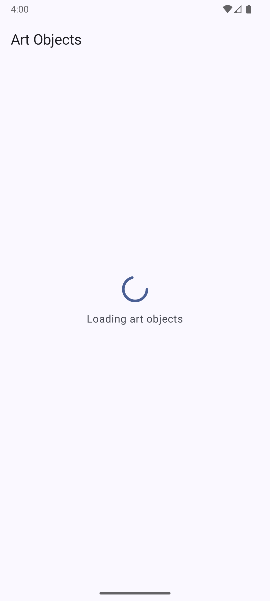
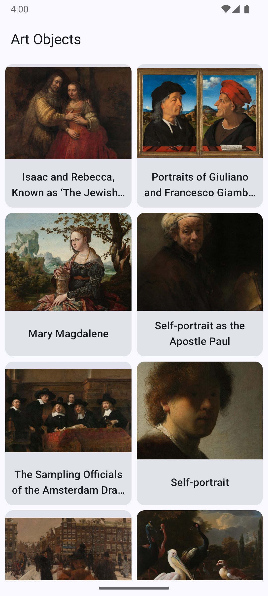
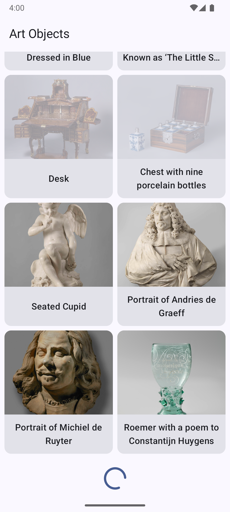
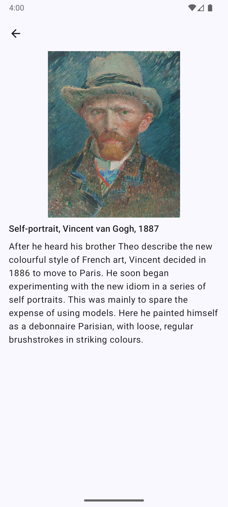

# Jetpack Compose Rijksmuseum App

## Setup

### API Key Configuration

This app uses the Rijksmuseum API, which requires an API key.

You need to update the `RIJKSMUSEUM_API_KEY` property in the `gradle.properties` file.

## Design

  
  
  
  

